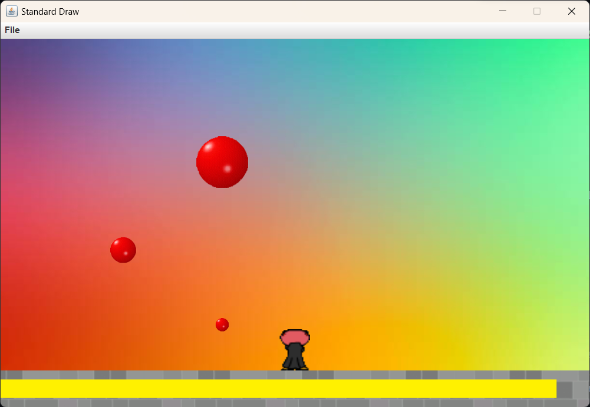
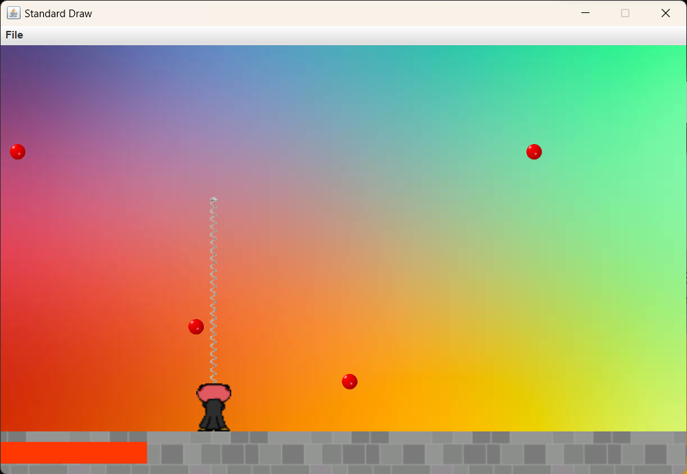
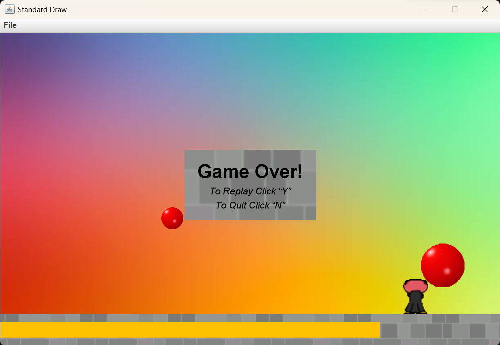
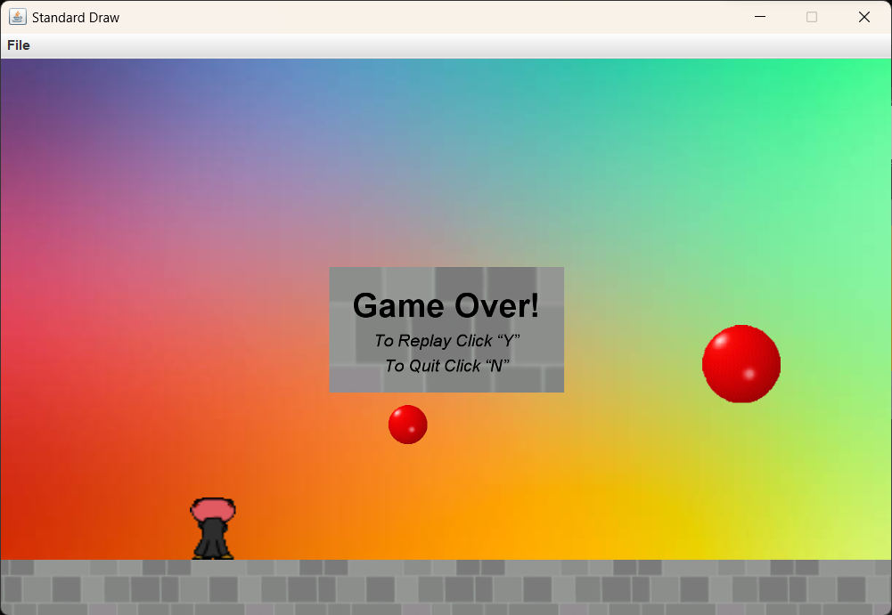
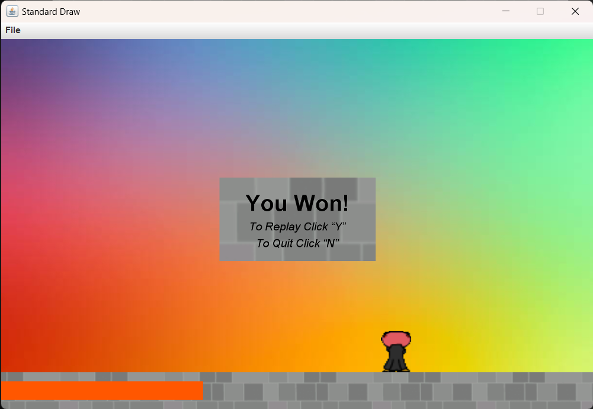

# CmpE160-Project2
## Assignment 2 Bubble Trouble
### Explanation of the code
The code consists of 6 java files.
#### suleyman_tolga_acar.java:
The main file to run the game. It has the main method in it. It initializes the environment and run the game.
#### Environment.java:
<pre>  It has the methods to draw everything to the screen and run the game. The player, bar, arrow and the balls objects are initialized here. In the method that runs the game, first of all, the objects and the canvas are initialized. Then the main game loop comes in (it is a while loop). Each frame it checks the player inputs and handles them using methods from the player object. Also, it checks collisions between the player and the balls and between the arrow and the balls using methods from the player object and arrow object. Then, it draws the new state of the game. Finally, it waits for a few miliseconds to run the game smoothly.  </pre>
  The game can end in a few different ways. The player can shoot all the balls and win, run out of time and lose, be hit by a ball and lose. When the game ends, the endgame screen is drawn. Then, we are in another while loop. In this loop we are waiting for the player to press a key. If “Y” is pressed, the method calls itself and runs the game from start. If “N” is pressed, the code terminates.
#### Player.java:
  It has methods to draw the player, move the player, shoot the arrow and check collisions with the balls. In the movement method, I calculated the distance to move using the time elapsed since the last frame. Because otherwise, the movement would be different depending on the FPS (frames per second). If the player presses arrow keys the method changes the player’s position accordingly. Shoot method sets the arrow active and sets its position to the player’s position.  
  While checking the collisions I did not assumed the ball as a rectangle as instructed. I found the nearest point on the player to the ball and I checked if the distance between that point and the ball is less than the ball’s radius. If the ball and the player collides the player loses and the game is over.
#### Arrow.java:
  It has methods to draw the arrow, set it active and inactive and check collisions with the balls. The arrow’s height is changing with the time. I calculated its height using the time elapsed since the arrow is shot. In the method where I check collisions, I used a similar logic. I assumed the arrow to be a rectangle with a small width and again I used the ball as a circle. If the arrow collides with a ball, depending on its level it either splits in two or disappears. If the balls level is 0, it is destroyed. If it is higher than 0, it is splitted in to two smaller balls. I created two new ball objects and put them in the balls list. 
#### Ball.java:
  It has methods to draw the ball and move the ball, also a few static methods to apply these former methods to all the balls. It has two constructor methods. One is to create the balls that are initially on the screen. The other one is to create new balls when they are split in two. It also has lots of getter and setter methods. The movement method uses ballistic motion and elastic collision principles to calculate the position of the ball. Again, I used the time elapsed to calculate the motion. The velocity in the X direction is constant, but in the Y direction it changes due to the gravity. If the ball hits the ground, I multiplied its velocity in the Y direction by -1. Similarly, if the ball hits the boundries of the canvas, I multiplied its velocity in the X direction by -1. 
#### Bar.java:
  It has methods to draw the bar to the screen and get the time left before the game ends. I calculated the bar’s width using the time passed since the start of the game. Also, depending on the time bar changes color from yellow to red.
### Photos of the game:

